# NativeStack — System Architecture

**An OrbStack-like macOS container manager built on Apple's Containerization framework**

| Field | Value |
|---|---|
| Version | 1.0-draft |
| Target platform | macOS 26+, Apple Silicon |
| Primary language | Swift 6 |
| UI framework | SwiftUI |
| Runtime foundation | [Containerization](https://github.com/apple/Containerization) + [Virtualization.framework](https://developer.apple.com/documentation/virtualization) |

---

## 1. Executive Summary

NativeStack is a native macOS container management platform that wraps Apple's open-source **Containerization** Swift package and provides an OrbStack-class developer experience: a background daemon, a Docker-familiar CLI, and a SwiftUI menu bar app for day-to-day container operations.

Unlike traditional Docker Desktop (one shared Linux VM hosting many containers), NativeStack follows Apple's **one-container-per-VM** model. Each container runs inside its own lightweight virtual machine with sub-second boot times, dedicated networking, and granular volume mounts — trading some memory overhead for stronger isolation and simpler data-sharing semantics.

The architecture is deliberately layered:

1. **Foundation** — Containerization framework (OCI, EXT4, Netlink, vminitd/gRPC)
2. **Daemon tier** — LaunchAgent-managed services communicating over XPC
3. **Client tier** — CLI, menu bar app, and future IDE plugins sharing a single Swift client library
4. **Orchestration tier** (optional) — Compose/Kubernetes adapters built on the same APIs

This document defines module boundaries, IPC contracts, lifecycle state machines, and operational flows for each subsystem.

---

## 2. Goals and Non-Goals

### Goals

| Goal | Rationale |
|---|---|
| Native-first on Apple Silicon | Leverage Virtualization.framework, vmnet, and Keychain without QEMU/VMware layers |
| Sub-second container start | Use Containerization's optimized kernel + vminitd init |
| OCI image interoperability | Pull from Docker Hub, GHCR, ECR; push portable images |
| OrbStack-like UX | Menu bar status, one-click start/stop, friendly DNS, low ceremony |
| Secure by default | Per-container VM isolation, minimal host mounts, sandboxed helpers |
| Extensible daemon API | Third-party tools integrate via stable XPC/gRPC client SDK |

### Non-Goals (v1)

- Running on Intel Macs or macOS < 26
- Replacing production Kubernetes clusters
- Full Docker Engine API compatibility (partial subset only)
- Windows/Linux host support
- Managing non-Linux workloads (macOS VMs are out of scope)

---

## 3. System Context

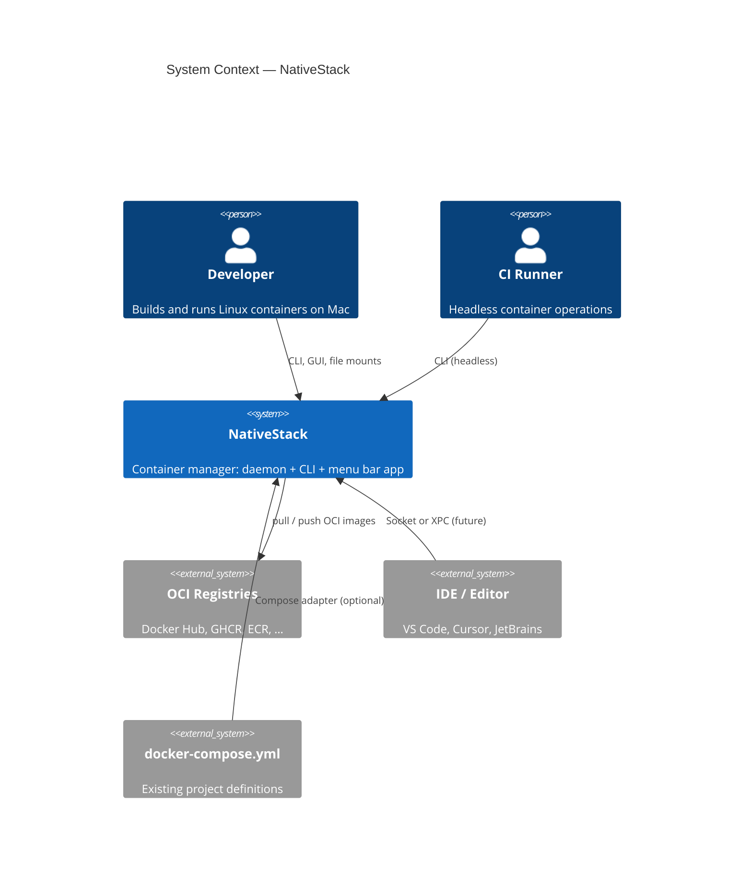

---

## 4. High-Level Architecture

NativeStack mirrors the proven decomposition of Apple's `container` tool while adding a first-class GUI client and richer orchestration features.

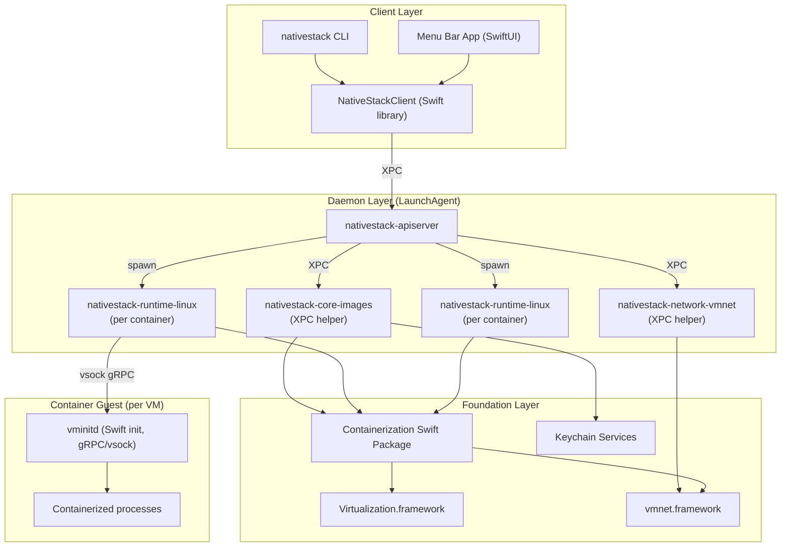

### Design Principles

1. **Thin clients, fat daemon** — All privileged operations (VM spawn, network creation, image extraction) happen in signed, Hardened Runtime helpers. Clients are unprivileged and restartable.
2. **One runtime helper per container** — Crash or compromise of one container does not take down the entire fleet.
3. **Stable client SDK** — CLI and GUI never import Containerization directly; they speak to `NativeStackClient`.
4. **Event-driven UI** — Daemon publishes container/network/image events; menu bar app subscribes for live updates.
5. **Fail closed** — Missing daemon, invalid mount paths, or network errors surface explicit errors; no silent fallback to host execution.

---

## 5. Technology Stack

| Layer | Technology | Notes |
|---|---|---|
| Language | Swift 6 | Strict concurrency, `Sendable` across XPC boundaries |
| Package manager | Swift Package Manager | Multi-target workspace with `@_exported import` only at SDK boundary |
| UI | SwiftUI + AppKit bridges | Menu bar `MenuBarExtra`, `Settings` scene, `NSOpenPanel` for mount picker |
| IPC (local) | XPC Services | Matches Apple's `container` pattern; typed Codable payloads |
| IPC (in-VM) | gRPC over vsock | Provided by Containerization / vminitd |
| VM runtime | Virtualization.framework | `VZVirtualMachine`, virtio block/net/console |
| Networking | vmnet.framework | Per-container IP on macOS 26; user-defined networks |
| Storage | APFS + ext4 block files | ContainerizationEXT4 for rootfs; copy-on-write snapshots (future) |
| Images | ContainerizationOCI | Index/layout/store; registry client with Keychain auth |
| Init system | vminitd | Swift static binary, process supervision inside guest |
| Service management | launchd | `LaunchAgent` for user daemon, `SMAppService` for menu bar login item |
| Logging | `os.Logger` (Unified Logging) | Subsystem `com.nativestack.*`, live streaming to GUI |
| Persistence | SQLite (GRDB) | Container metadata, networks, settings; images use content-addressable store |
| Credentials | Keychain Services | Registry tokens via `kSecAttrService` scoped per registry host |
| Distribution | Developer ID signed `.pkg` | Ships daemon, CLI, menu bar app; `notarytool` stapling |
| Testing | Swift Testing + XCTest | Unit tests for state machine; integration tests with real VMs (CI Mac runners) |

### Key External Dependencies

```swift
// Package.swift (conceptual)
dependencies: [
    .package(url: "https://github.com/apple/containerization", from: "0.33.0"),
    .package(url: "https://github.com/groue/GRDB.swift", from: "7.0.0"),
    .package(url: "https://github.com/apple/swift-argument-parser", from: "1.5.0"),
]
```

---

## 6. Module Structure

The repository is a Swift workspace with six top-level packages. Each package has a narrow responsibility and explicit dependency direction (no cycles).

```
NativeStack/
├── Packages/
│   ├── NativeStackCore/           # Shared models, errors, constants
│   ├── NativeStackDaemon/         # apiserver + XPC helpers
│   ├── NativeStackClient/         # XPC client SDK (used by CLI + GUI)
│   ├── NativeStackCLI/            # ArgumentParser commands
│   ├── NativeStackMenuBar/        # SwiftUI menu bar application
│   └── NativeStackCompose/        # Optional: compose.yml translator
├── Apps/
│   └── NativeStack.xcworkspace
├── Resources/
│   ├── LaunchAgents/
│   │   └── com.nativestack.apiserver.plist
│   └── Kernel/                    # Bundled optimized kernel (from Containerization)
├── Scripts/
│   ├── install.sh
│   └── codesign-daemon.sh
└── ARCHITECTURE.md
```

### Package Dependency Graph

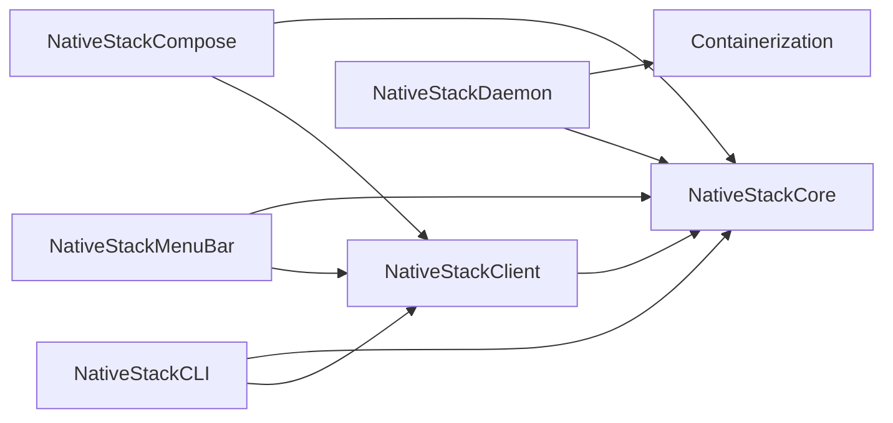

### Module Breakdown

| Module | Targets | Responsibility |
|---|---|---|
| **NativeStackCore** | `Models`, `Events`, `Errors`, `Configuration` | `ContainerSpec`, `NetworkSpec`, `MountSpec`, `ImageRef`, `ContainerState` enum, event payloads |
| **NativeStackDaemon** | `APIServer`, `ImageService`, `NetworkService`, `RuntimeService`, `Persistence` | LaunchAgent entry point, XPC listeners, Containerization orchestration |
| **NativeStackClient** | `DaemonConnection`, `ContainerAPI`, `ImageAPI`, `NetworkAPI`, `EventStream` | Async/await wrappers over XPC; reconnect + version negotiation |
| **NativeStackCLI** | `nativestack` executable | `run`, `ps`, `stop`, `image`, `network`, `system`, `logs` commands |
| **NativeStackMenuBar** | `NativeStackMenuBarApp` | Status icon, container list, resource meters, preferences |
| **NativeStackCompose** | `ComposeParser`, `ComposeRunner` | v3 compose subset → NativeStack API calls |

---

## 7. Daemon / Service Layer

The daemon tier is the system's control plane. It is modeled after Apple's `container-apiserver` architecture with NativeStack-specific extensions for GUI event streaming and DNS.

### 7.1 Process Topology

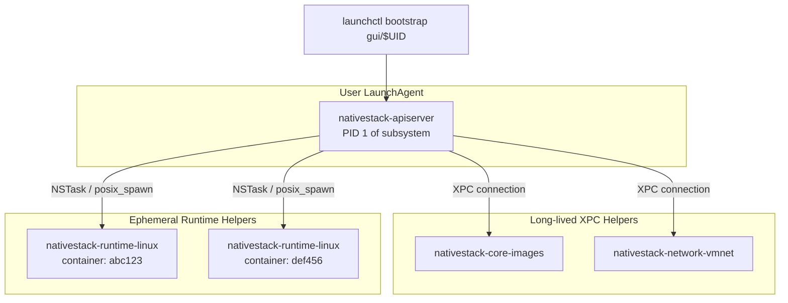

| Process | Lifetime | Privileges | Responsibility |
|---|---|---|---|
| `nativestack-apiserver` | User session | Hardened Runtime, no root | API routing, state DB, spawns runtime helpers, event bus |
| `nativestack-core-images` | Daemon lifetime | File-system access to `~/Library/Application Support/NativeStack/images` | OCI pull/push, layer dedup, build context |
| `nativestack-network-vmnet` | Daemon lifetime | vmnet entitlement | Create/attach virtual networks, IPAM, DNS registration |
| `nativestack-runtime-linux` | Per container | Virtualization entitlement | Owns one `LinuxContainer`, vsock to vminitd |

### 7.2 APIServer Internals

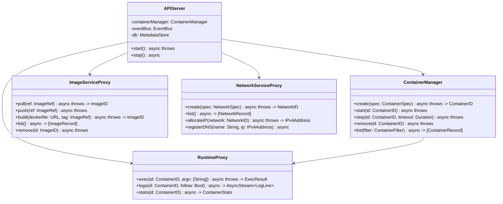

### 7.3 XPC Protocol Surface

All XPC interfaces are versioned (`protocolVersion: UInt32`). Clients perform a handshake before invoking methods.

| Service | Protocol | Key Methods |
|---|---|---|
| `com.nativestack.api` | `NSXPCConnection` | `systemStatus`, `subscribeEvents`, `negotiateVersion` |
| `com.nativestack.images` | XPC | `pull`, `push`, `inspect`, `prune`, `resolve` |
| `com.nativestack.network` | XPC | `createNetwork`, `deleteNetwork`, `assignIP`, `listInterfaces` |
| `com.nativestack.runtime.{id}` | XPC | `start`, `stop`, `exec`, `attach`, `resize` |

### 7.4 Service Lifecycle (`launchd`)

```xml
<!-- com.nativestack.apiserver.plist (simplified) -->
<key>Label</key><string>com.nativestack.apiserver</string>
<key>ProgramArguments</key>
<array>
  <string>/Applications/NativeStack.app/Contents/MacOS/nativestack-apiserver</string>
</array>
<key>RunAtLoad</key><false/>
<key>KeepAlive</key><false/>
<key>ProcessType</key><string>Interactive</string>
<key>StandardOutPath</key><string>/tmp/nativestack-apiserver.log</string>
```

Activation flow:

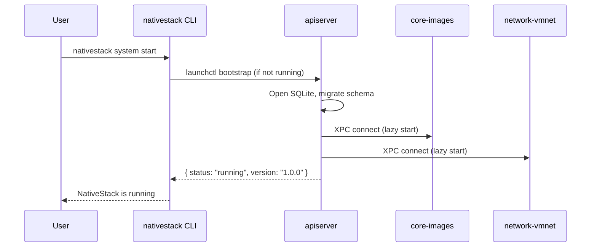

---

## 8. CLI Interface

The CLI (`nativestack`) is a thin ArgumentParser front-end over `NativeStackClient`. It aims for Docker muscle-memory compatibility where practical.

### 8.1 Command Tree

```
nativestack
├── run          # Create + start (foreground or -d detached)
├── create       # Create without starting
├── start|stop|restart|rm
├── ps           # List containers (-a all, --filter)
├── logs         # Stream stdout/stderr (-f follow)
├── exec         # Run command in running container
├── inspect      # JSON metadata dump
├── image
│   ├── pull|push|build|tag|rm|ls|prune
│   └── login|logout
├── network
│   ├── create|rm|ls|inspect
├── volume         # v1: bind mounts only; named volumes in v2
├── system
│   ├── start|stop|status|info|prune
│   └── events     # Stream daemon events (JSON lines)
├── machine        # Container machines (persistent Linux envs)
│   ├── create|start|stop|ssh|rm|ls
└── compose        # Delegates to NativeStackCompose
    └── up|down|ps|logs
```

### 8.2 CLI ↔ Daemon Sequence (run)

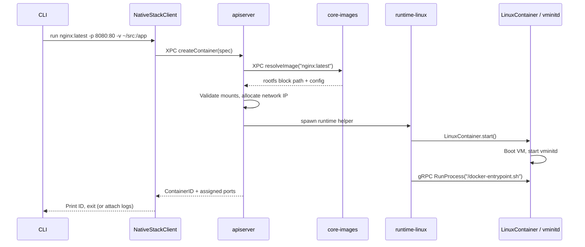

### 8.3 Output Modes

| Flag | Behavior |
|---|---|
| Default | Human-readable tables (`.ps`, `.image ls`) |
| `--format json` | Machine-readable for scripts |
| `--quiet` | Suppress progress bars on pull/build |
| `--debug` | Echo XPC method names + latency |

---

## 9. SwiftUI Menu Bar App

The menu bar app is the primary GUI surface — always accessible, low footprint, and event-driven.

### 9.1 App Architecture (MVVM + Observation)

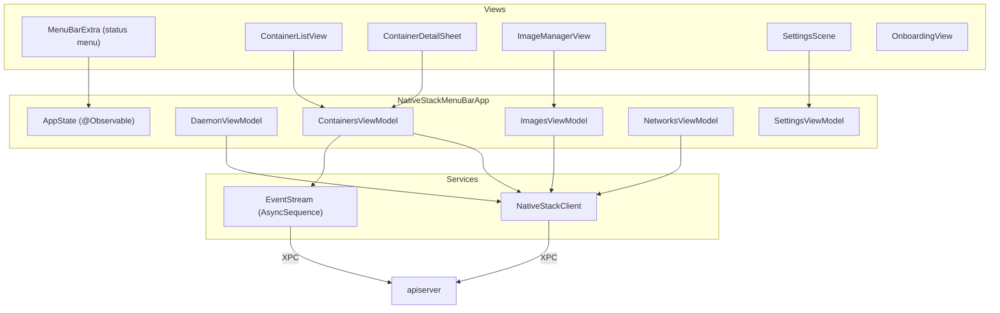

### 9.2 Key UI Surfaces

| Surface | Purpose |
|---|---|
| **Status icon** | Green = daemon running + healthy; amber = starting; red = stopped/error; badge = running container count |
| **Quick menu** | Start/stop daemon, list running containers, "Open Dashboard", quit |
| **Container list** | Name, image, state, CPU/mem sparkline, ports, uptime |
| **Container detail** | Logs viewer (streaming), env vars, mounts, port map, restart policy |
| **Images panel** | Local images, pull dialog, disk usage, prune |
| **Networks panel** | User-defined networks, subnet, connected containers |
| **Preferences** | Resource defaults, DNS domain (`*.nativestack.local`), file sharing roots, auto-start daemon |
| **Onboarding** | Install verification, kernel check, first `hello-world` pull |

### 9.3 Menu Bar Interaction Flow

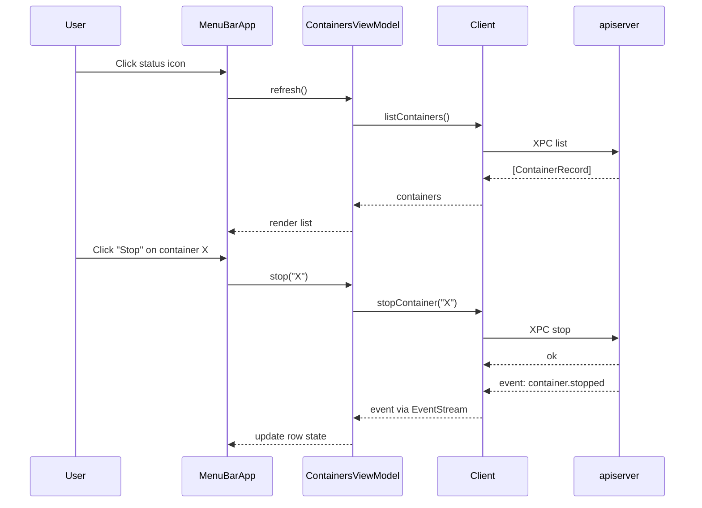

### 9.4 Login Item Registration

Use `SMAppService` (macOS 13+) for the menu bar app:

```swift
// On first launch or via Preferences toggle
try SMAppService.mainApp.register()
```

The menu bar app does **not** embed the daemon. On launch it checks daemon health and offers one-click `system start` if needed.

---

## 10. Container Lifecycle

### 10.1 State Machine

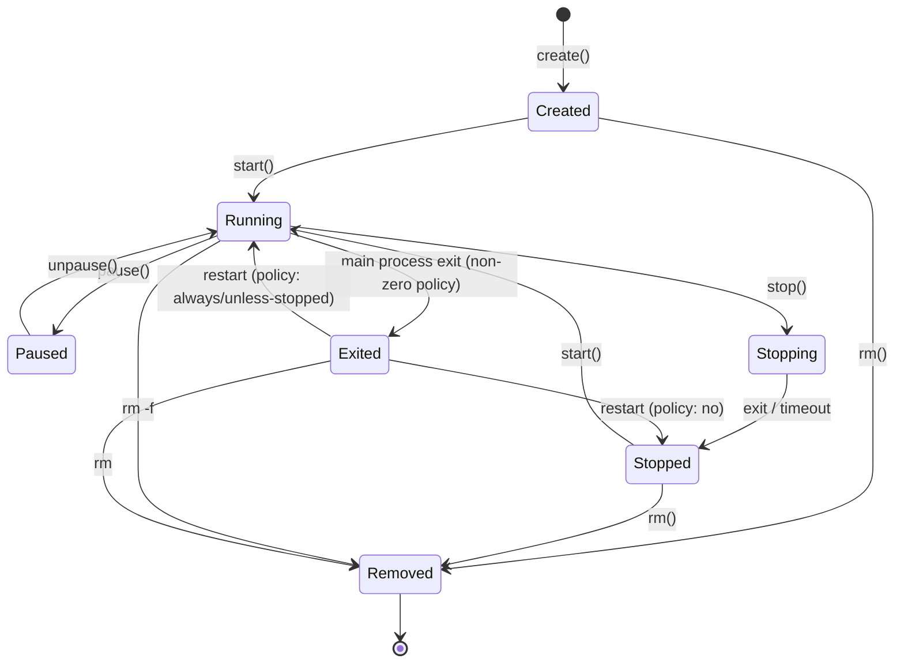

### 10.2 ContainerSpec (Core Model)

```swift
struct ContainerSpec: Codable, Sendable {
    var name: String?
    var image: ImageRef
    var command: [String]?
    var entrypoint: [String]?
    var environment: [String: String]
    var mounts: [MountSpec]
    var portBindings: [PortBinding]      // host:container / proto
    var network: NetworkAttachment
    var resources: ResourceLimits
    var labels: [String: String]
    var restartPolicy: RestartPolicy
    var initProcess: Bool                // --init: tiny init wrapper
    var workingDirectory: String?
    var user: String?                    // UID:GID or username
    var hostname: String?
    var dns: [String]                    // Per-container DNS servers
    var privileged: Bool                 // Extended device access (discouraged)
    var rosetta: Bool                    // linux/amd64 via Rosetta
}

struct ResourceLimits: Codable, Sendable {
    var memoryBytes: UInt64?             // VM RAM cap
    var cpuCount: Int?                   // Virtual CPU cores
    var cpuWeight: Int?                  // Relative scheduling weight
}
```

### 10.3 Lifecycle Orchestration (Daemon)

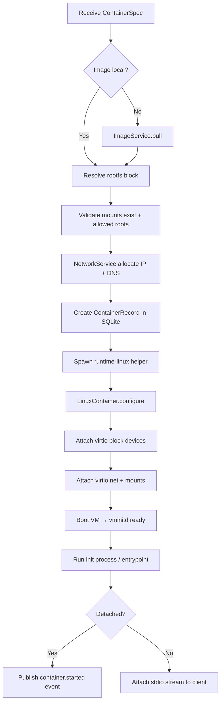

### 10.4 Restart Policies

| Policy | Behavior |
|---|---|
| `no` | Exit leaves container in `exited` state |
| `on-failure[:max]` | Restart only on non-zero exit, up to `max` |
| `unless-stopped` | Always restart unless user explicitly stopped |
| `always` | Always restart, including on daemon restart |

On `apiserver` startup, containers with `unless-stopped` or `always` are re-started in dependency order (future: compose project groups).

---

## 11. Networking

NativeStack networking builds on **vmnet.framework** (macOS 26) and Containerization's **Netlink** APIs for in-guest interface configuration.

### 11.1 Network Model

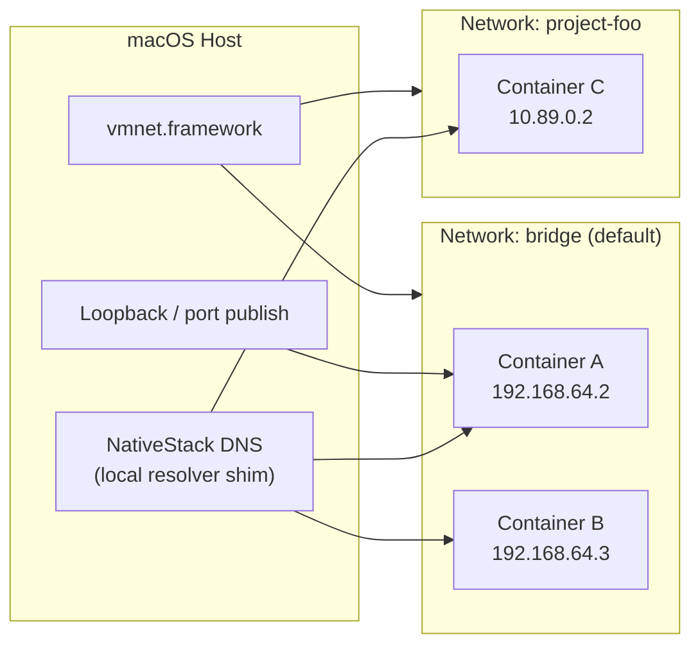

| Concept | Implementation |
|---|---|
| **Default network** | `bridge` — shared L2 segment; containers can reach each other (macOS 26+) |
| **User-defined networks** | Isolated vmnet interfaces with custom CIDR (`10.89.0.0/24`) |
| **Per-container IP** | Dedicated IPv4 assigned by `network-vmnet` IPAM |
| **Port publishing** | Host port → guest IP:port via vmnet NAT + `pf` rules |
| **DNS** | `container-name.nativestack.local` → guest IP; configurable search domain |
| **Host access** | `host.nativestack.internal` resolves to vmnet gateway |
| **Container ↔ container** | Direct IP or DNS name on same network |

### 11.2 NetworkService Responsibilities

```swift
struct NetworkSpec: Codable, Sendable {
    var name: String
    var driver: NetworkDriver    // .bridge | .isolated
    var subnet: CIDR?            // Auto if nil
    var gateway: IPv4Address?
    var dns: [IPv4Address]
    var labels: [String: String]
}

enum NetworkDriver: String, Codable {
    case bridge     // Inter-container connectivity
    case isolated   // No inter-container (macOS 15 compat mode)
}
```

### 11.3 Port Binding Flow

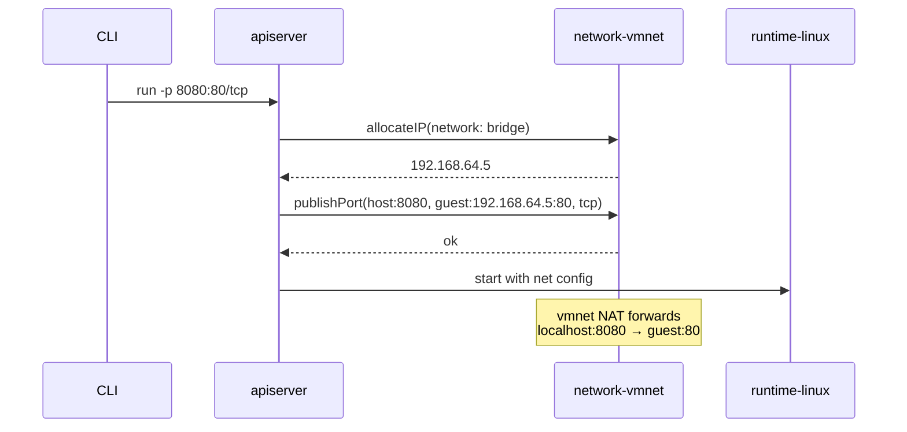

### 11.4 OrbStack-Style DNS (Differentiator)

A lightweight userspace DNS proxy binds to `127.0.0.1:53` (or a high port with resolver config) and resolves:

- `<container>.<network>.nativestack.local` → guest IP
- `*.nativestack.local` wildcard for compose project aliases

Configuration is exposed in Preferences and stored in `~/Library/Application Support/NativeStack/dns.json`.

---

## 12. Volume Mounts

Per-container VM isolation means mounts are **per-VM virtio-fs or block exports**, not bind mounts into a shared Linux VM. This is more secure (only mount what each container needs) but requires explicit path validation.

### 12.1 Mount Types

| Type | v1 | v2 (planned) | Mechanism |
|---|---|---|---|
| **Bind mount** | ✅ | ✅ | virtio-fs export of host directory into guest |
| **Read-only bind** | ✅ | ✅ | `:ro` flag on virtio-fs export |
| **Named volume** | ❌ | ✅ | ext4 block file in `~/Library/.../volumes/` |
| **tmpfs** | ❌ | ✅ | In-guest tmpfs via vminitd |
| **Secrets** | ❌ | ✅ | Keychain-backed, injected as tmpfs files |

### 12.2 MountSpec

```swift
struct MountSpec: Codable, Sendable {
    var source: MountSource
    var destination: String          // Absolute path inside container
    var readOnly: Bool
    var propagation: MountPropagation // .private default
    var label: String?                 // SELinux-like labels (future)
}

enum MountSource: Codable, Sendable {
    case bind(hostPath: String)
    case volume(name: String, subpath: String?)
    case image(mountpoint: String)    // OCI image mount (future)
}
```

### 12.3 Mount Security Pipeline

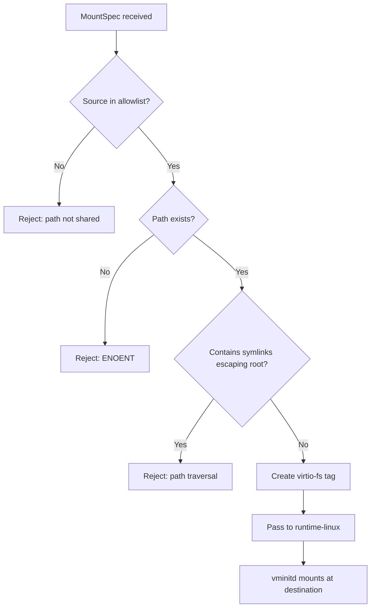

**File sharing allowlist** (Preferences / `~/.nativestack/file-sharing.json`):

```json
{
  "allowedRoots": [
    "/Users",
    "/tmp",
    "/var/folders"
  ],
  "requireApproval": true
}
```

When `requireApproval` is true, the menu bar app prompts on first mount of a new root (similar to OrbStack/Docker Desktop).

### 12.4 Mount Attachment Sequence

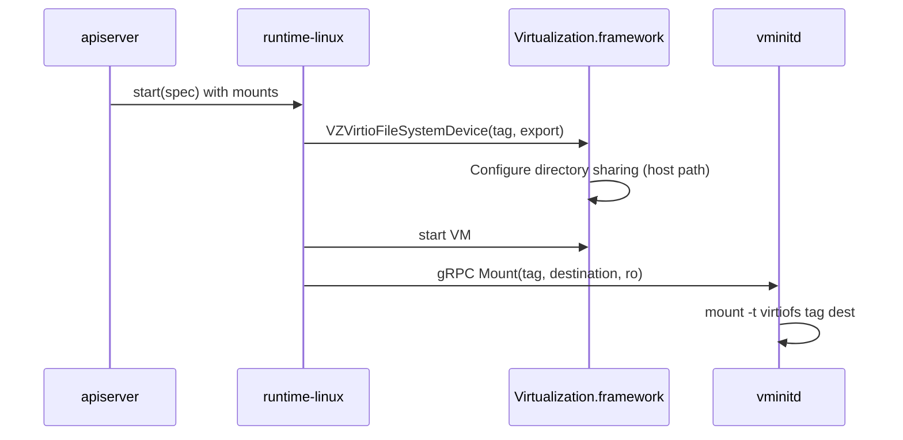

---

## 13. Image Management

Image operations delegate to **ContainerizationOCI** inside `nativestack-core-images`.

### 13.1 Content Store Layout

```
~/Library/Application Support/NativeStack/
├── images/
│   ├── blobs/
│   │   └── sha256/
│   │       ├── abc.../          # Layer blob
│   │       └── def.../
│   ├── manifests/
│   └── indexes/
├── containers/
│   └── {uuid}.json              # Container metadata
├── networks/
│   └── {name}.json
├── kernels/
│   └── vmlinux-6.14.9           # Bundled optimized kernel
└── nativestack.sqlite
```

### 13.2 Image Pipeline

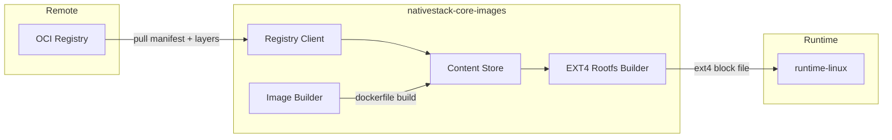

### 13.3 Supported Operations

| Operation | API | Notes |
|---|---|---|
| `pull` | `ImageService.pull(ref)` | Progress events streamed to client; layer dedup by digest |
| `push` | `ImageService.push(ref)` | Requires `docker login` credentials in Keychain |
| `build` | `ImageService.build(dockerfile:tag:)` | Dockerfile subset; multi-stage in v2 |
| `tag` | `ImageService.tag(source:target:)` | Manifest relabel, no data copy |
| `remove` | `ImageService.remove(id)` | Ref-counted; blocked if containers reference |
| `prune` | `ImageService.prune(filter)` | Remove dangling layers |
| `inspect` | `ImageService.inspect(ref)` | OCI manifest + config JSON |

### 13.4 Registry Authentication

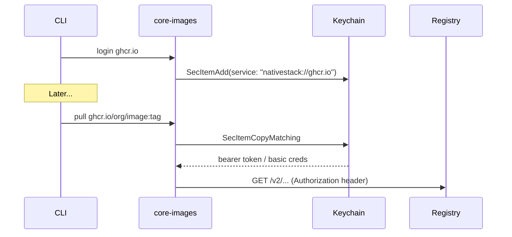

### 13.5 Platform / Architecture

| Platform | Support |
|---|---|
| `linux/arm64` | Native on Apple Silicon |
| `linux/amd64` | Via Rosetta 2 (`--platform linux/amd64` or `rosetta: true` in spec) |

Image resolution selects the best matching manifest; missing arm64 with Rosetta enabled triggers amd64 pull + Rosetta runtime flag on `LinuxContainer`.

---

## 14. Event System

A unified event bus enables the menu bar app and `nativestack system events` to react to daemon activity without polling.

### Event Types

```swift
enum NativeStackEvent: Codable, Sendable {
    case daemonStarted(version: String)
    case containerCreated(id: ContainerID, name: String?)
    case containerStarted(id: ContainerID)
    case containerStopped(id: ContainerID, exitCode: Int32)
    case containerDied(id: ContainerID, oomKilled: Bool)
    case imagePullProgress(ref: ImageRef, completed: UInt64, total: UInt64)
    case imagePullComplete(ref: ImageRef)
    case networkCreated(name: String)
    case logLine(id: ContainerID, stream: LogStream, text: String)
}
```

Delivery: XPC `subscribeEvents` returns an `NSXPCListener` endpoint; client receives `Codable` envelopes over an `AsyncStream`.

---

## 15. Security Model

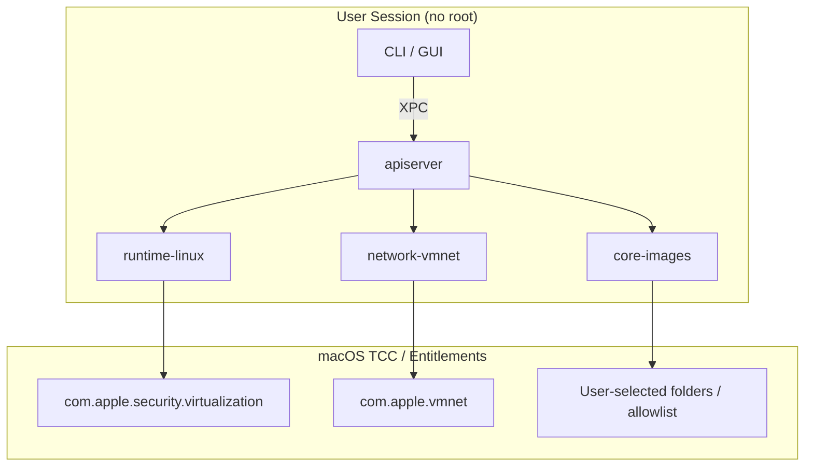

| Concern | Mitigation |
|---|---|
| VM escape | Apple's Virtualization.framework boundary; minimal virtio attack surface |
| Host file exfiltration | Mount allowlist + symlink validation + optional approval UI |
| Registry credential theft | Keychain with `kSecAttrAccessibleWhenUnlockedThisDeviceOnly` |
| Daemon impersonation | XPC `auditToken` validation; code signature check on clients |
| Container breakout to host | Per-container VM; no shared kernel between containers |
| Network exposure | Published ports bound to `127.0.0.1` by default; opt-in `0.0.0.0` |

---

## 16. Data Persistence

### SQLite Schema (simplified)

```sql
CREATE TABLE containers (
    id            TEXT PRIMARY KEY,
    name          TEXT UNIQUE,
    image_id      TEXT NOT NULL,
    state         TEXT NOT NULL,
    spec_json     BLOB NOT NULL,
    created_at    INTEGER NOT NULL,
    started_at    INTEGER,
    finished_at   INTEGER,
    exit_code     INTEGER,
    runtime_pid   INTEGER
);

CREATE TABLE images (
    id            TEXT PRIMARY KEY,
    ref           TEXT NOT NULL,
    digest        TEXT NOT NULL,
    size_bytes    INTEGER,
    created_at    INTEGER NOT NULL
);

CREATE TABLE networks (
    id            TEXT PRIMARY KEY,
    name          TEXT UNIQUE NOT NULL,
    spec_json     BLOB NOT NULL,
    created_at    INTEGER NOT NULL
);

CREATE TABLE ip_allocations (
    network_id    TEXT NOT NULL,
    container_id  TEXT,
    ip_address    TEXT NOT NULL,
    UNIQUE(network_id, ip_address)
);
```

---

## 17. Container Machines (Future-Ready)

Apple's WWDC 2026 **Container machine** feature provides persistent, stateful Linux environments. NativeStack exposes this as a first-class `machine` subcommand and a menu bar section.

| Property | Container | Machine |
|---|---|---|
| Lifetime | Ephemeral (removed on `rm`) | Persistent across reboots |
| Rootfs | OCI image (read-only + overlay) | Mutable ext4 volume |
| Use case | CI jobs, one-off services | Daily-driver Linux dev environment |
| Integration | Port bindings | SSH, shared `$HOME` mirroring |

`MachineManager` is a thin wrapper over Containerization's machine APIs, sharing the same `network-vmnet` and `core-images` helpers.

---

## 18. Deployment and Distribution

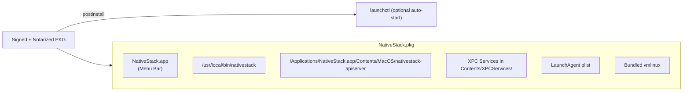

| Artifact | Install Location |
|---|---|
| Menu bar app | `/Applications/NativeStack.app` |
| CLI | `/usr/local/bin/nativestack` |
| Daemon + XPC helpers | Inside app bundle `Contents/MacOS/` and `Contents/XPCServices/` |
| LaunchAgent plist | `~/Library/LaunchAgents/com.nativestack.apiserver.plist` |
| User data | `~/Library/Application Support/NativeStack/` |
| Logs | `~/Library/Logs/NativeStack/` (auto-rotated) |

---

## 19. Observability

| Signal | Mechanism |
|---|---|
| Structured logs | `Logger(subsystem: "com.nativestack", category: "runtime")` |
| Metrics | `ContainerStats`: CPU %, memory used/limit, network RX/TX bytes |
| Tracing | Signpost intervals around VM boot, image pull, mount attach |
| Health check | `nativestack system status` → `{ daemon, images, network, version }` |
| GUI dashboard | Sparklines from periodic `stats()` polling (1s interval when detail open) |

---

## 20. Comparison with OrbStack and Docker Desktop

| Dimension | Docker Desktop | OrbStack | NativeStack |
|---|---|---|---|
| VM model | Single shared Linux VM | Lightweight per-container VM | Per-container VM (Containerization) |
| Framework | QEMU / proprietary | Custom | Virtualization.framework (Apple) |
| Language | Go + Electron UI | Go + Swift UI | Swift end-to-end |
| Image format | OCI | OCI | OCI (ContainerizationOCI) |
| macOS integration | Moderate | Strong | Native (Keychain, vmnet, SMAppService) |
| Menu bar app | Yes | Yes | SwiftUI MenuBarExtra |
| K8s local | Yes | Yes | Planned (via compose/machine) |
| Open source core | No | No | Built on open-source Containerization |

---

## 21. Implementation Roadmap

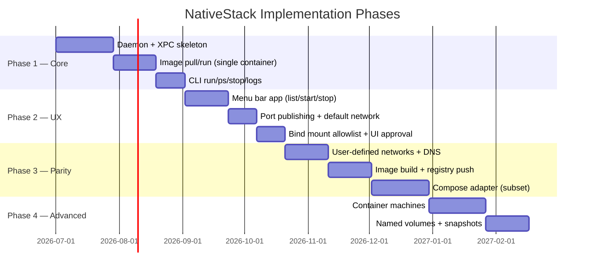

### Phase 1 Exit Criteria

- `nativestack system start` launches apiserver and helpers
- `nativestack run -d nginx` starts a container with published port
- `nativestack ps` and `nativestack logs` work against running containers
- Menu bar icon reflects daemon state

---

## 22. Key Component Summary

| Component | Type | Owns |
|---|---|---|
| `nativestack-apiserver` | LaunchAgent daemon | SQLite, container state machine, helper orchestration |
| `nativestack-core-images` | XPC helper | OCI content store, pull/push/build |
| `nativestack-network-vmnet` | XPC helper | vmnet interfaces, IPAM, port publish, DNS shim |
| `nativestack-runtime-linux` | Per-container XPC helper | One `LinuxContainer`, vminitd gRPC session |
| `NativeStackClient` | Swift library | XPC transport, typed APIs, event stream |
| `nativestack` CLI | Executable | Developer-facing commands |
| `NativeStackMenuBarApp` | SwiftUI app | GUI, preferences, onboarding |
| `vminitd` | Guest init (from Containerization) | In-VM process supervision, mounts, I/O |
| `MetadataStore` | SQLite (GRDB) | Durable container/network/image records |
| `EventBus` | In-process pub/sub | Fan-out to XPC event subscribers |

---

## 23. References

- [Apple Containerization (GitHub)](https://github.com/apple/Containerization)
- [Apple container CLI (GitHub)](https://github.com/apple/Container)
- [Container technical overview](https://github.com/apple/Container/blob/main/docs/technical-overview.md)
- [Virtualization.framework documentation](https://developer.apple.com/documentation/virtualization)
- [WWDC25 — Meet Containerization](https://developer.apple.com/videos/play/wwdc2025/)
- [WWDC26 — Discover container machines](https://developer.apple.com/videos/play/wwdc2026/389/)
- [OCI Image Specification](https://github.com/opencontainers/image-spec)

---

*This document is a living architecture specification. Implementation details may evolve with Containerization framework releases.*

